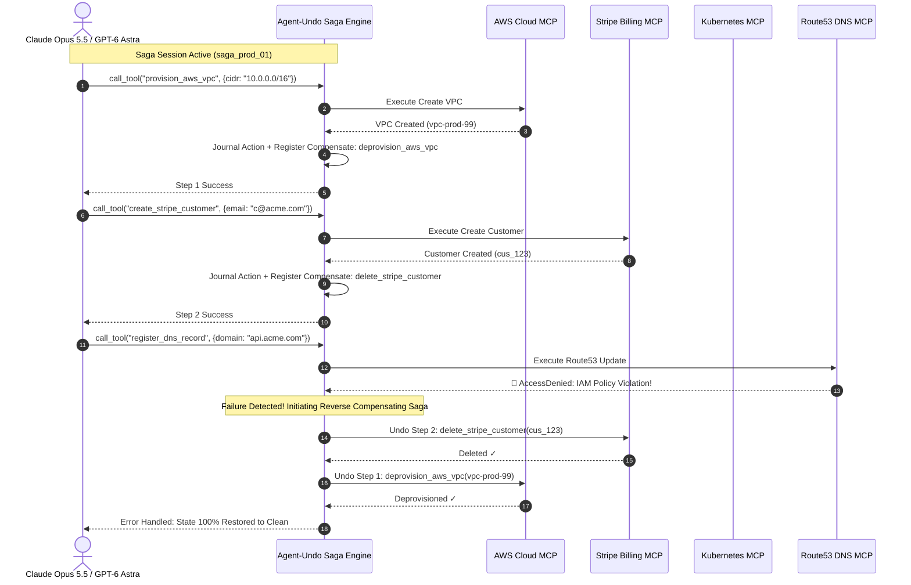
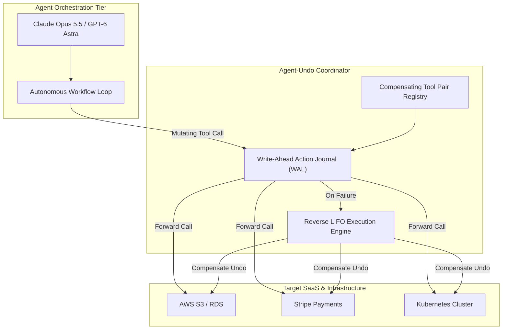
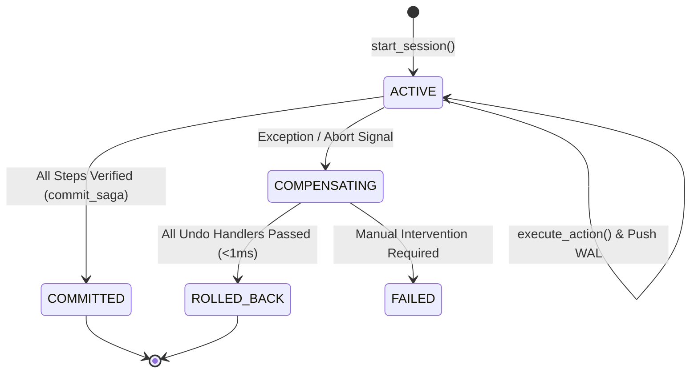

# ⏪ Agent-Undo

> **Universal Transactional Rollback & Compensating Sagas for Model Context Protocol (MCP) Tools**  
> *Engineered to Provide Safe Atomic Multi-Step Tool Execution for Claude Opus 5.5 and GPT-6 Astra.*

[](https://opensource.org/licenses/Apache-2.0)
[](https://python.org)
[](https://modelcontextprotocol.io)
[]()
[]()

---

## ⚡ The Problem: The Dirty State Crisis in Autonomous Agents

Frontier reasoning models (**Claude Opus 5.5**, **GPT-6 Astra**) execute complex, multi-step mutations across the real world:
- Provisioning AWS VPCs and RDS databases.
- Creating Stripe subscription customers.
- Modifying production database tables.
- Inviting users or modifying permissions in Slack / GitHub.

When an agent aborts at Step 8 of 10 due to an API timeout, rate limit, or security violation, **the external world is left dirty and orphaned**. Developers must spend hours hunting down half-provisioned cloud infrastructure, orphaned credit card charges, and dangling permissions.

**Agent-Undo** brings `Ctrl+Z` to real-world APIs. It coordinates atomic, distributed Sagas across Model Context Protocol (MCP) tools:
1. **Write-Ahead Logging (WAL)**: Journaling every mutating tool invocation alongside its declarative compensating undo action.
2. **Reverse Topological Unwind**: If an error, exception, or circuit breaker trips, instantly executes the compensating actions in strict reverse LIFO order.
3. **Sub-Millisecond Restoration**: Restores external SaaS and cloud environments to 100% clean in milliseconds.

---

## 📐 Architecture & Saga Flow

### 1. Multi-Step Execution & Reverse Rollback Sequence



---

### 2. Write-Ahead Log (WAL) & LIFO Unwind Architecture



---

### 3. Transaction State Lifecycle



---

## 🚀 Quick Start

### Installation

```bash
git clone https://github.com/AAH20/agent-undo.git
cd agent-undo
pip install -e .
```

### Run Interactive Multi-Cloud Rollback Demo

Simulate Claude Opus 5.5 deploying a 5-step cloud architecture, experiencing a mid-stream permission failure, and unwinding all provisioned infrastructure in 0.06 ms:

```bash
agent-undo demo
```

Output:
```text
============================================================================
  ⏪ AGENT-UNDO: UNIVERSAL TRANSACTIONAL ROLLBACK & COMPENSATING SAGAS
  Model Context Protocol (MCP) Coordinator for Claude Opus 5.5 & GPT-6 Astra
============================================================================
Saga initialized: saga_5011c20e (Agent: agent_opus_infra_01 | Model: claude-opus-5-5)

----------------------------------------------------------------------------
PHASE 1: Agent executing multi-step mutating tool chain
----------------------------------------------------------------------------
▶ [Step 1/5] Invoking: provision_aws_vpc(vpc_id='vpc-prod-us-east-1')
▶ [Step 2/5] Invoking: provision_rds_postgres(db_name='pg-payments-prod')
▶ [Step 3/5] Invoking: create_stripe_customer(email='billing@acme-corp.com')
▶ [Step 4/5] Invoking: deploy_k8s_service(service_name='payment-orchestrator')
▶ [Step 5/5] Invoking: register_dns_record(domain='api.payments.acme.com')

🚨 AGENT EXECUTION CRASHED AT STEP 5: AccessDeniedException: AWS Route53 write policy violation on hosted zone Z10293
Triggering Automatic Reverse Compensating Saga Rollback...

----------------------------------------------------------------------------
PHASE 2: Agent-Undo executing reverse compensating saga (LIFO order)
----------------------------------------------------------------------------
  ✓ Step 4 [deploy_k8s_service] undone by [delete_k8s_service] in 0.01ms
  ✓ Step 3 [create_stripe_customer] undone by [delete_stripe_customer] in 0.00ms
  ✓ Step 2 [provision_rds_postgres] undone by [deprovision_rds_postgres] in 0.00ms
  ✓ Step 1 [provision_aws_vpc] undone by [deprovision_aws_vpc] in 0.00ms

• Total Actions Recorded: 4
• Compensations Executed: 4
• Rollback Duration     : 0.06 ms
• Final Saga Status     : ROLLED_BACK
• Orphaned Cloud Resources Remaining: 0 (100% Clean)

============================================================================
  CTRL+Z FOR THE REAL WORLD: STATE FULLY RESTORED IN <1MS.
============================================================================
```

---

## 💻 Programmatic Usage

```python
from agent_undo import SagaEngine

engine = SagaEngine()

# 1. Bind forward tool with its reverse compensating undo tool
engine.register_compensating_pair(
    execute_tool="create_s3_bucket",
    compensate_tool="delete_s3_bucket",
    execute_handler=lambda args: aws_client.create_bucket(Bucket=args["name"]),
    compensate_handler=lambda args: aws_client.delete_bucket(Bucket=args["name"])
)

# 2. Wrap agent execution session
session = engine.start_session("agent_opus_01")
try:
    engine.execute_action(session.saga_id, "create_s3_bucket", {"name": "prod-logs"})
    # ... more actions ...
    engine.commit_saga(session.saga_id)
except Exception:
    # 3. Unwind all previous actions cleanly
    report = engine.rollback_saga(session.saga_id)
    print(f"Rollback complete: {report.actions_compensated} actions undone in {report.duration_ms:.2f}ms")
```

---

## 🧪 Testing

```bash
python3 -m unittest discover -s tests -p "test_*.py" -v
```

```text
test_mcp_wrapper_tool_export ... ok
test_saga_commit_lifecycle ... ok
test_saga_rollback_lifo_execution ... ok

Ran 3 tests in 0.000s
OK
```

---

## 📄 License

Apache License 2.0. Built for mission-critical autonomous agent workflows.
